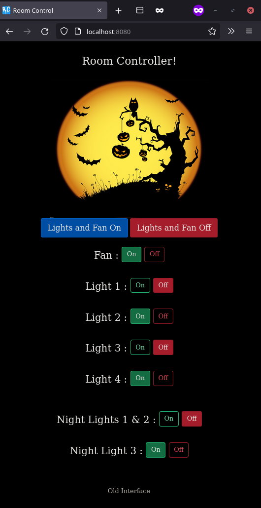
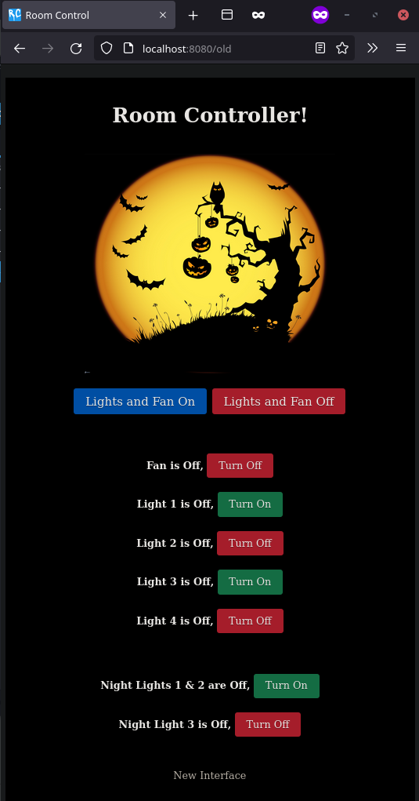

# Flask Server for Home automation using Raspberry Pi

A simple FLASK WebServer to control things in your home using Raspberry Pi's GPIOs programmed as outputs (acting as actuators).

---

## Screenshots

|  New Interface (Default)  | Old Interface |
| --- | ----------- |
|  |  |

---

## Install

### Method 1 (Automatic)

```sh
$ curl -sSL https://raw.githubusercontent.com/HritwikSinghal/room_control_server/master/install.sh | bash
```

The server will start automatically on Network connect. You can check the status of server by below command.

```
$ sudo systemctl status room_control_flask.service
```

### Method 2 (Manual)

Clone this repository using

```sh
$ cd ~
$ git clone https://github.com/HritwikSinghal/room_control_server
```

Enter the directory and install all the requirements using

```sh
$ cd room_control_server
$ pip3 install -r requirements.txt
```

(Optional) Enable Systemd service to start on network connect

```sh
$ sudo chmod +x room_control_flask.service
$ sudo cp room_control_flask.service /etc/systemd/system/
$ sudo systemctl enable room_control_flask.service
$ sudo systemctl start room_control_flask.service
```

Run the app (or don't if it was started in last step)

```sh
$ python3 run.py
```

---

## License

[GPLv3](/LICENSE)

---
For GPIO connections and how to connect the relay, you can visit [this website](https://lastminuteengineers.com/two-channel-relay-module-arduino-tutorial/).  [Here](https://web.archive.org/web/20210728191456/https://lastminuteengineers.com/two-channel-relay-module-arduino-tutorial/) is archived version of above page from wayback.

Thanks to [RPi-Flask-WebServer](https://github.com/Mjrovai/RPi-Flask-WebServer) and
[NetworkChuck](https://github.com/theNetworkChuck/NetworkChuck) for providing base code.  
